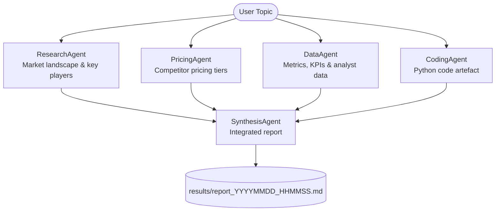

# Multi-Agent Market Intelligence Pipeline

A multi-agent AI pipeline built with [Google ADK](https://google.github.io/adk-docs/) that takes any market topic, runs four specialist agents in parallel, and synthesises their outputs into a single client-ready report saved as a Markdown file.

---

## What It Does

Given a topic (e.g. *"AI coding assistant market"*), the pipeline:

1. Runs **four specialist agents in parallel** — each performing a distinct research task using live Google Search
2. Feeds all four outputs to a **synthesis agent** that produces a unified, structured report
3. Saves the final report to the `results/` directory as a timestamped `.md` file

---

## Project Workflow



---

## Agents

| Agent | Role | Model |
|---|---|---|
| `ResearchAgent` | Market landscape, key players, recent news, trends | `gemma-3-4b-it` |
| `PricingAgent` | Competitor pricing tiers, free vs paid, benchmarks | `gemma-3-4b-it` |
| `DataAgent` | Market size, CAGR, usage figures, analyst reports | `gemma-3-4b-it` |
| `CodingAgent` | Generates a production-ready Python script for the topic | `gemma-3-12b-it` |
| `SynthesisAgent` | Merges all four outputs into a structured integrated report | `gemma-3-12b-it` |

---

## Project Structure

```
Agentic_AI/
├── agents/
│   ├── research_agent.py       # ResearchAgent definition
│   ├── pricing_agent.py        # PricingAgent definition
│   ├── data_agent.py           # DataAgent definition
│   ├── coding_agent.py         # CodingAgent definition
│   ├── merger_agent.py         # SynthesisAgent definition
│   └── pipeline/
│       └── execution.py        # Pipeline orchestration & root_agent
├── results/                    # Auto-created; stores output reports
├── main.py                     # Entry point
├── gemini_api_key.py           # Model name constants
├── requirements.txt
└── .env                        # API keys (not committed)
```

---

## Requirements

- Python 3.10+
- A [Google AI Studio](https://aistudio.google.com/) API key with access to Gemma models

---

## Installation

```bash
# 1. Clone the repository
git clone https://github.com/vedant1100/Multi-Agent.git
cd Multi-Agent

# 2. Create and activate a virtual environment
python -m venv .venv

# Windows
.venv\Scripts\activate

# macOS / Linux
source .venv/bin/activate

# 3. Install dependencies
pip install -r requirements.txt
```

---

## Configuration

Create a `.env` file in the project root:

```env
GOOGLE_API_KEY="your_google_api_key_here"
GOOGLE_GENAI_USE_VERTEXAI=FALSE
```

> **Never commit your `.env` file.** It is already listed in `.gitignore`.

---

## Running the Pipeline

Edit the topic at the bottom of `main.py`:

```python
if __name__ == "__main__":
    asyncio.run(run("Analyse the AI coding assistant market"))
```

Then run:

```bash
python main.py
```

The report is saved to `results/report_YYYYMMDD_HHMMSS.md`. The terminal prints the file path when done.

---

## Dependencies

| Package | Purpose |
|---|---|
| `google-adk` | Agent Development Kit — orchestrates agents and tool use |
| `litellm` | Unified interface to call Gemma models via Google AI |
| `gemini` | Gemini APIs used internally |
| `python-dotenv` | Loads `GOOGLE_API_KEY` from `.env` at runtime |

Install all at once:

```bash
pip install -r requirements.txt
```
